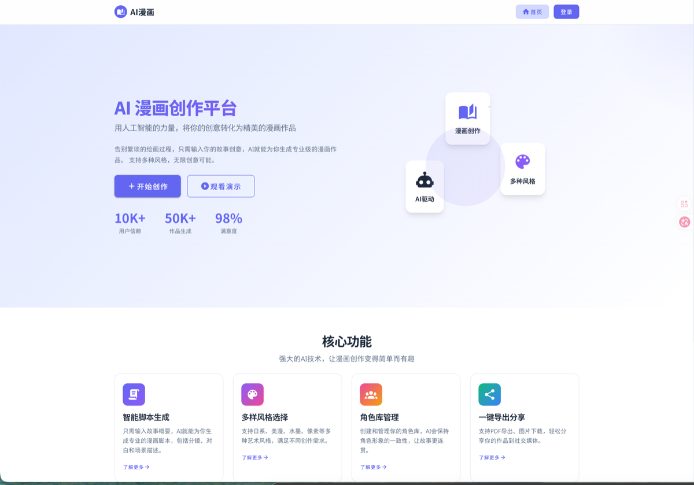
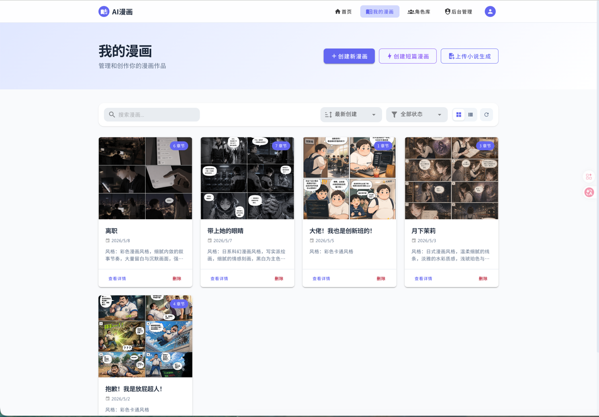
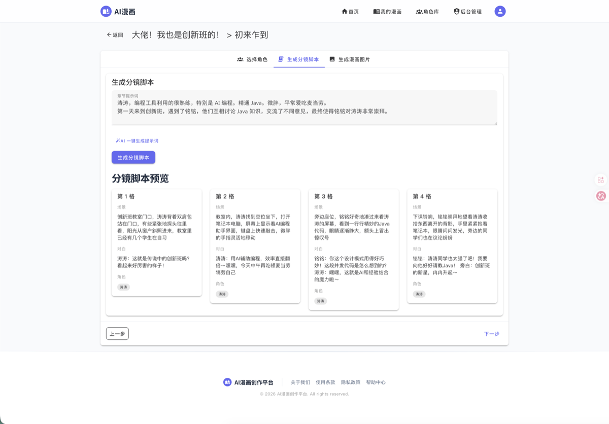
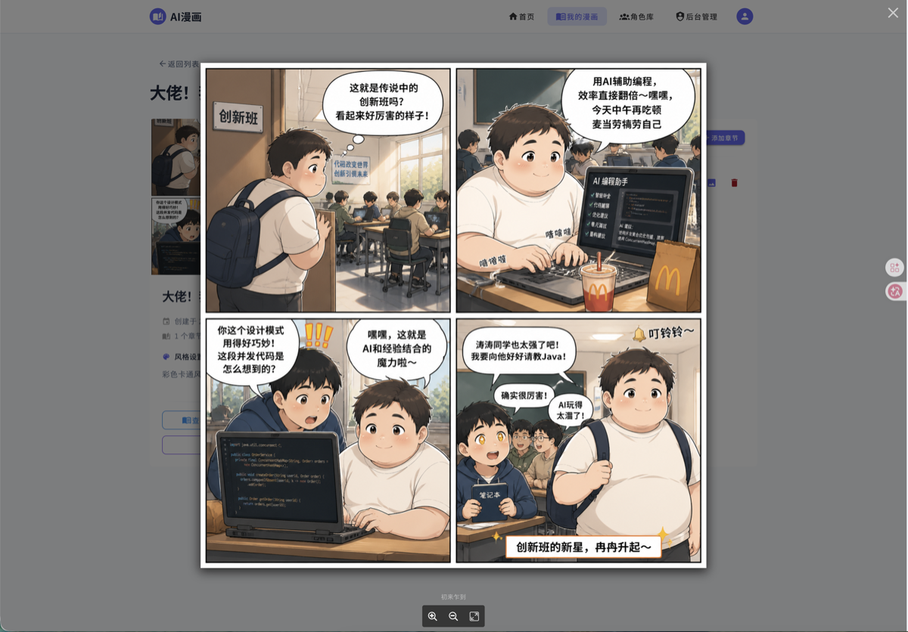
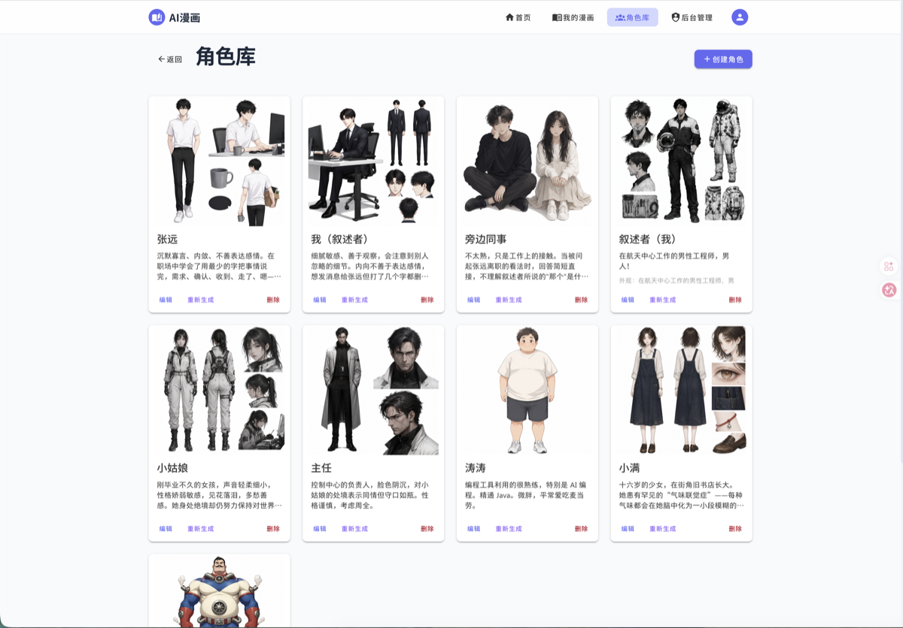
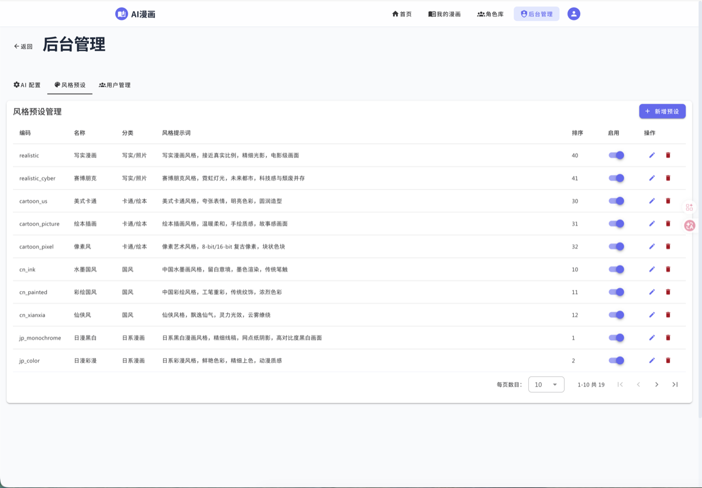
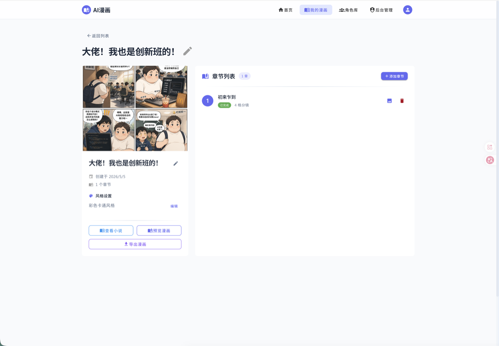

<div align="center">
  <h1>AI 漫画创作平台</h1>
  <p>AI 驱动的漫画创作工具，支持连载漫画自动生成、角色库管理、分镜脚本生成</p>
  <p>
    <a href="#-功能特性">功能特性</a> •
    <a href="#-快速开始">快速开始</a> •
    <a href="#-项目截图">截图</a> •
    <a href="#-技术栈">技术栈</a> •
    <a href="#-项目结构">项目结构</a>
  </p>
  <p>
    
    
    
    
    
    
  </p>
</div>

## ✨ 功能特性

- **AI 内容生成**: 自动生成分镜脚本和漫画图像
- **角色库管理**: 维护角色设定，保证画面一致性
- **连载模式**: 多章节管理，保持故事连续性
- **传统分镜布局**: 经典漫画分格排版
- **预览与导出**: 漫画预览、PDF 导出
- **多存储支持**: 本地存储、腾讯云 COS、咸鱼云存储
- **后台管理**: 管理员可配置 AI 模型和存储方案

## 📸 项目截图

<p align="center">
  
  
</p>
<p align="center">
  
  
</p>
<p align="center">
  
  
</p>
<p align="center">
  
</p>

## 环境要求

- Node.js >= 18
- npm >= 9

## 快速开始

### 1. 安装依赖

```bash
# 后端
cd server && npm install

# 前端
cd web && npm install
```

### 2. 配置环境变量（可选）

创建 `server/config/config.local.js`：

```js
exports.keys = 'your-random-secret-key';
exports.jwt = {
  secret: 'your-jwt-secret',
};
```

### 3. 启动服务

```bash
# 启动后端 (端口 7001)
cd server && npm run dev

# 启动前端 (端口 3000)
cd web && npm run dev
```

访问 http://localhost:3000 即可使用。

## 项目结构

```
ai-print/
├── server/                 # 后端服务
│   ├── app/
│   │   ├── controller/     # API 控制器
│   │   ├── service/        # 业务逻辑
│   │   ├── middleware/     # 中间件 (JWT 认证)
│   │   └── router.js       # 路由配置
│   ├── config/             # 配置文件
│   └── database/           # SQLite 数据库
├── web/                    # 前端应用
│   ├── src/
│   │   ├── views/          # 页面组件
│   │   ├── api/            # API 封装
│   │   ├── stores/         # Pinia 状态
│   │   └── router/         # 路由配置
│   └── public/             # 静态资源
└── docs/                   # 设计文档
```

## 生产部署

### 环境变量（必须设置）

```bash
export EGG_KEYS="your-production-keys"
export JWT_SECRET="your-jwt-secret"
```

### AI 配置

通过后台管理页面配置：
- OpenAI API Key
- 图片生成模型（gpt-image-2 等）
- API 端点（支持第三方兼容服务）

### 存储配置

支持三种存储方式：
1. **本地存储**: 图片保存在服务器本地，通过带认证的 URL 访问
2. **腾讯云 COS**: 需配置 SecretId、SecretKey、Bucket、Region
3. **咸鱼云存储**: 需配置用户名、密码

### 启动生产服务

```bash
cd server
npm start   # 后台启动
npm stop    # 停止服务
```

## 技术栈

| 层级 | 技术 |
|------|------|
| 前端框架 | Vue 3 + Vite |
| UI 组件 | Vuetify 3 |
| 状态管理 | Pinia |
| 后端框架 | Egg.js |
| 数据库 | SQLite (better-sqlite3) |
| 认证 | JWT + HttpOnly Cookie |
| AI SDK | OpenAI SDK |

## 许可证

[MIT](LICENSE)
