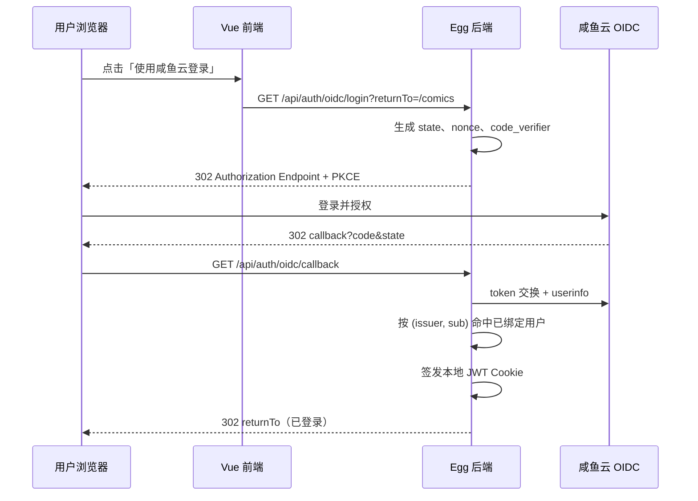
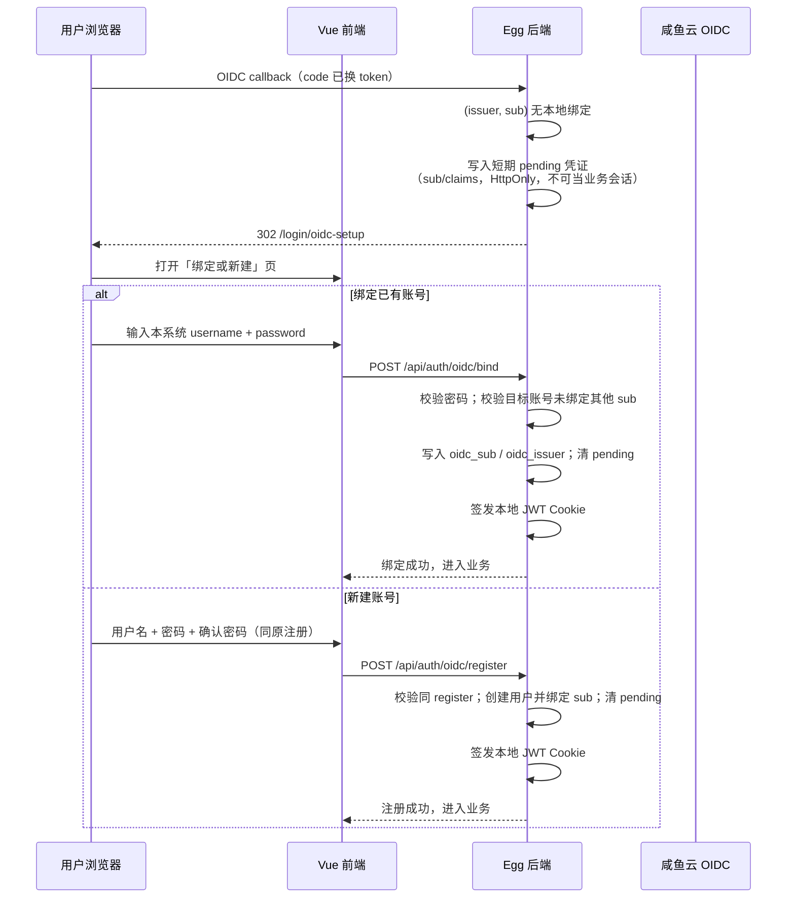

# 标准 OIDC 登录接入技术方案

> 状态：MVP 已实施（Phase 1+2）  
> 日期：2026-08-04  
> 范围：AI 漫画创作平台（ai-print）接入咸鱼云网盘 OIDC Provider  
> 参考：
> - Discovery：`https://disk.xiaotao2333.top:344/.well-known/openid-configuration`
> - 官方文档：`https://mjt233.github.io/saltedfishcloud-backend/oauth/oidc/`

---

## 1. 背景与目标

### 1.1 现状

当前系统认证为**本地账号密码 + 自签 JWT + HttpOnly Cookie**：

| 层 | 现状 | 关键代码 |
|---|---|---|
| 注册/登录 | `username` + `password`，bcrypt 哈希 | `server/app/service/auth.js` |
| 会话 | `jwt.sign({ id, username })`，写入 Cookie `token` | `AuthService.setAuthCookie` |
| 鉴权中间件 | 读 Cookie → `jwt.verify` → 查 `users` 表 | `server/app/middleware/jwt.js` |
| 前端 | Pinia + `withCredentials`，无 token 明文 | `web/src/stores/auth.js`、`web/src/api/auth.js` |
| 用户表 | `id / username / password NOT NULL / is_admin / created_at` | `server/database/init.sql` |

业务 API 全部依赖本地 JWT 中间件，**与 OIDC 无耦合**。这是好事：接入 OIDC 时可以走「登录桥接」而不是整站改成 Bearer 校验。

### 1.2 目标

1. 支持用户通过 **标准 OIDC** 登录本系统（以咸鱼云为联调 IdP，实现上**通用**，不绑死某一厂商）。
2. **后台可配置 OIDC**（启用开关、issuer、client、回调、按钮文案等），无需改代码换 IdP。
3. **保留本地注册与密码登录**；同一账号可「密码 + OIDC」双方式登录（绑定后）。
4. **一人一账号**：一个 OIDC `(issuer, sub)` 对应一行 `users`；OIDC 回来若无绑定，**必须**走「绑定已有账号」或「新建账号」。
5. **一期用户侧不做解绑**；**管理后台**可查看绑定情况并解绑。
6. **不破坏**现有 JWT Cookie 鉴权与业务 API。
7. 符合 OAuth 2.1 / OIDC 安全实践（Authorization Code + PKCE，secret 不出浏览器）。

### 1.3 非目标（本期不做）

- 不把本系统改造成 OIDC Provider。
- 不依赖 RP-Initiated Logout。
- 不替换现有管理员体系为 IdP 角色映射。
- **不做**「同名自动合并」或「静默 JIT 建号」。
- **不做**用户自助解绑（仅管理员可解绑）。
- **暂不考虑**用户误选「新建」导致双号后的合并工具。
- 一期只支持 **一套** OIDC 配置（单 IdP）；不做多 IdP 并列登录。

---

## 2. IdP 能力盘点（一手事实）

### 2.1 Discovery 元数据（实测）

| 字段 | 值 |
|---|---|
| `issuer` | `https://disk.xiaotao2333.top:344` |
| `authorization_endpoint` | `.../oauth2/authorize` |
| `token_endpoint` | `.../oauth2/token` |
| `userinfo_endpoint` | `.../oauth2/userinfo` |
| `jwks_uri` | `.../oauth2/jwks` |
| `revocation_endpoint` | `.../oauth2/revoke` |
| `introspection_endpoint` | `.../oauth2/introspect` |
| `end_session_endpoint` | `.../connect/logout`（**不建议当稳定能力依赖**） |
| `response_types_supported` | **仅 `code`** |
| `grant_types_supported` | `authorization_code`, `refresh_token`, `client_credentials`, device, token-exchange |
| `code_challenge_methods_supported` | **仅 `S256`** |
| `id_token_signing_alg_values_supported` | `RS256` |
| `scopes_supported`（Discovery） | `openid`, `profile`, `storage_read`, `storage_write` |
| 客户端认证 | `client_secret_basic` / `client_secret_post` 等 |

JWKS 已可达，`id_token` 可用 RS256 + JWKS 验签。

### 2.2 官方文档补充

| 能力 | 说明 |
|---|---|
| 实现底座 | Spring Authorization Server，标准 OIDC / OAuth 2.1 |
| confidential client | `client_secret_basic` / `client_secret_post` |
| public client | `none`，**强制 PKCE** |
| UserInfo：`sub` | 系统用户 `uid` 的字符串形式 |
| UserInfo：`profile` | `preferred_username`、`name`、`picture` |
| UserInfo：`email` | 文档提到 scope `email`；**当前 Discovery 的 `scopes_supported` 未列出 `email`**（见 §9 不确认点） |
| 登出 | 优先 `/oauth2/revoke`，勿依赖 `/connect/logout` |
| 客户端注册 | 由咸鱼云「第三方应用管理」维护 client 元数据 |

### 2.3 推荐使用的协议路径

```
Authorization Code Flow + PKCE (S256)
  + scope: openid profile
  + confidential client（后端持有 client_secret）
```

理由：

1. IdP **只支持** `response_type=code`，没有 Implicit。
2. PKCE 是 OAuth 2.1 默认要求；IdP 仅支持 `S256`。
3. confidential client 把 `client_secret` 放在 Egg 服务端，避免 SPA 泄露。
4. 本系统已是 BFF 形态（前端只认 Cookie），与 confidential client 天然契合。

---

## 3. 总体架构

### 3.1 推荐模式：后端 BFF 登录桥接

```
┌─────────────┐     ① 点击「咸鱼云登录」      ┌──────────────────┐
│  Vue 前端   │ ───────────────────────────► │  Egg 后端 (RP)   │
│  Login.vue  │                              │  /api/auth/oidc/*│
└─────────────┘                              └────────┬─────────┘
       ▲                                              │
       │ ⑤ 回跳 + 已设 Cookie                          │ ② 302 → authorize
       │                                              ▼
       │                                     ┌──────────────────┐
       │                                     │ 咸鱼云 OIDC IdP  │
       │                                     │ authorize/token  │
       │                                     │ userinfo / jwks  │
       │                                     └────────┬─────────┘
       │                                              │
       │ ④ code 回调后端                               │ ③ 用户登录授权
       └──────────────────────────────────────────────┘
```

核心原则：

1. **OIDC 只负责「证明你是谁」**。
2. **本系统会话仍用本地 JWT Cookie**（现有 `jwt` 中间件零改或极小改）。
3. OIDC `access_token` / `refresh_token` **不进入浏览器**；如需保留，仅存服务端（可选，见 §6.4）。

### 3.2 为什么不选 SPA Public Client

| 方案 | 优点 | 缺点 | 结论 |
|---|---|---|---|
| SPA + PKCE public client | 前端直连 IdP | secret 无；token 进浏览器；与现有 Cookie 会话割裂；CORS/redirect 复杂 | **不推荐** |
| 后端 confidential + PKCE | secret 安全；与现有 JWT 会话无缝；可统一 CSRF/state | 多 2 个后端路由 | **推荐** |

---

## 4. 登录时序

### 4.1 已绑定账号：OIDC 直登



### 4.2 首次 OIDC：未绑定 → 强制「绑定或新建」

产品规则：**不支持同时拥有两个业务账号**。  
因此 **禁止** callback 后静默 `createUser`；必须进入账号决策页。



**关键约束：**

| 规则 | 说明 |
|---|---|
| 一个 `sub` 只能绑一个 `users.id` | DB 唯一索引保证 |
| 一个 `users.id` 只能绑一个 `sub` | 绑定前检查 `oidc_sub IS NULL` |
| 禁止静默双号 | 未绑定绝不直接进业务并另起一行用户 |
| 绑定需验密 | 防止「扫到别人电脑 / 伪造 flow」接管本地账号 |
| 新建同原注册 | 用户名唯一 + **强制密码**（长度等规则与 `auth.register` 一致） |
| pending 短时 | 建议 10 分钟；过期须重新走 OIDC |

---

## 5. 身份映射与用户模型

### 5.1 映射键

| 来源 | 字段 | 用途 |
|---|---|---|
| IdP | `sub`（uid 字符串） | **唯一、稳定**的外部身份主键 |
| IdP | `preferred_username` / `name` | 新建账号时的用户名默认建议值 |
| 本系统 | `users.id` | 业务外键（comics、characters 等） |

**必须用 `sub` 关联，禁止仅用用户名关联或同名自动合并。**  
用户名在 IdP 侧可能变更；`sub` 为 uid，稳定。

### 5.2 产品策略：一人一账号（已确认）

| 策略 | 是否采用 | 说明 |
|---|---|---|
| 静默 JIT 建号 | **否** | 无绑定必须显式决策 |
| 同名自动绑定 | **否** | 账号接管风险 |
| **首次显式：绑定或新建** | **是** | 绑定验密；新建唯一行 |
| 本地注册入口 | **保留** | 与 OIDC 并行 |
| OIDC 新建强制密码 | **是** | 与本地注册相同：用户名 + 密码（及确认密码） |
| 用户自助解绑 | **否（一期）** | 仅后台解绑 |
| 误建双号合并 | **暂不考虑** | — |

结果形态：

```
本地注册账号 ──┬── 未绑 OIDC：仅密码登录
               └── 已绑 OIDC：密码 或 OIDC 均可登录同一 users 行

OIDC 新建账号 ── 绑定 sub + 强制本地密码（同原注册规则）
                 → auth_provider = both（密码与 OIDC 均可登录）
```

靠 **强制决策页 + `(issuer,sub)` 唯一绑定** 保证映射清晰；管理员可在后台查看/解绑。

### 5.3 数据库变更（增量、幂等）

遵循项目约束：用 `ALTER TABLE`，不删库，不删用户数据。

```sql
-- migrate-oidc.js（示例逻辑，实施时写成幂等脚本）

ALTER TABLE users ADD COLUMN oidc_sub TEXT;           -- 咸鱼云 uid
ALTER TABLE users ADD COLUMN oidc_issuer TEXT;        -- issuer，防多 IdP 冲突
ALTER TABLE users ADD COLUMN display_name TEXT;       -- 可选
ALTER TABLE users ADD COLUMN avatar_url TEXT;         -- 可选，来自 picture
-- auth_provider：local = 仅密码；both = 已设密码且已绑 OIDC
-- 一期新建/绑定后均为 both 或 local，不产生「仅 oidc 无密码」账号
ALTER TABLE users ADD COLUMN auth_provider TEXT DEFAULT 'local';

-- 一个 sub 只能对应一个用户
CREATE UNIQUE INDEX IF NOT EXISTS idx_users_oidc
  ON users(oidc_issuer, oidc_sub)
  WHERE oidc_sub IS NOT NULL;
```

密码字段策略：

- **不改** `password NOT NULL`（与现表一致）。
- **OIDC 新建**：走与本地注册**相同校验**（用户名 3–50、密码至少 6 位等，见 `controller/auth.js` register）；bcrypt 存真实密码；绑定 `sub`；`auth_provider='both'`。
- **绑定已有账号**：保留原密码；写入 `oidc_sub` / `oidc_issuer`；`auth_provider='both'`。
- 不再创建「无本地密码、仅 OIDC」账号（新建路径强制设密）。

### 5.4 状态机（核心）

```
OIDC callback 成功
  │
  ├─ 已存在 (issuer, sub) 绑定
  │     → 签发 JWT → 业务页
  │
  └─ 未绑定
        → 写 oidc_pending Cookie（含 sub、username 建议、过期时间、签名）
        → 302 /login/oidc-setup
              │
              ├─ POST /oidc/bind { username, password }
              │     校验本地密码成功
              │     且目标用户 oidc_sub 为空
              │     且 sub 未被他人占用
              │     → 绑定 → 清 pending → 签发 JWT
              │
              └─ POST /oidc/register { username, password }
                    校验同本地 register（用户名/密码规则）
                    username 未占用
                    → 创建用户（真实密码哈希）+ 绑定 sub
                    → 清 pending → 签发 JWT
```

绑定失败示例：

| 情况 | HTTP | 提示方向 |
|---|---|---|
| 用户名或密码错误 | 401 | 不暴露「用户是否存在」细节（与现登录一致） |
| 该账号已绑定其他 OIDC 身份 | 409 | 请换账号或联系管理员在后台解绑 |
| 该 OIDC 身份已绑其他本地号 | 409 | 防并发；提示联系管理员 |
| pending 过期/缺失 | 401 | 请重新点击第三方登录 |

### 5.5 密码策略（OIDC 新建）— 已确认

| 项 | 决策 |
|---|---|
| 本地「注册」入口 | **保留**（Login 页注册 Tab 不变） |
| OIDC 决策页「新建账号」 | **强制本地密码**，规则与原注册流程一致 |
| 校验复用 | 用户名 3–50、密码 ≥ 6；前端确认密码一致；后端与 `auth.register` 同源规则 |
| 新建结果 | 真实密码哈希 + OIDC 绑定 → `auth_provider=both`，密码与 OIDC 均可登录 |
| 绑定已有账号 | 必须验本地密码；绑定后 `both` |

### 5.6 权限与后台账号管理

- 业务管理员字段仍为本地 `users.is_admin`；OIDC **不**自动赋 admin。
- **绑定到已有管理员** → 继承 `is_admin`。
- **新建** → 沿用 `createUserWithAdminCheck`。
- 管理员接口扩展（见 §6.2）：用户列表展示绑定信息；支持**后台解绑**。
- **用户侧一期无解绑入口**。

---

## 6. 后端设计

### 6.1 OIDC 配置：通用 + 后台可配

目标：**不硬编码咸鱼云**；任意符合标准 OIDC Discovery 的 IdP，均可在管理后台填配置启用。

#### 6.1.1 存储位置

沿用现有 `configs` 表（`category` + `key` + JSON `value`），扩展允许的 category：

| category | key | 说明 |
|---|---|---|
| `auth` | `oidc` | 当前唯一一套 OIDC 客户端配置 |

`value` 结构示例：

```json
{
  "enabled": false,
  "displayName": "咸鱼云登录",
  "issuer": "https://disk.xiaotao2333.top:344",
  "clientId": "",
  "clientSecret": "",
  "redirectUri": "https://your-app.example.com/api/auth/oidc/callback",
  "scopes": ["openid", "profile"],
  "stateTtlSec": 600,
  "tokenAuthMethod": "client_secret_basic"
}
```

| 字段 | 必填 | 说明 |
|---|---|---|
| `enabled` | 是 | 关闭时隐藏登录按钮；login 整页跳转失败时 `?oidc_error=not_enabled` |
| `displayName` | 是 | 登录页按钮文案（通用，非写死「咸鱼云」） |
| `issuer` | 启用时必填 | OIDC issuer；用 `{issuer}/.well-known/openid-configuration` 做 Discovery |
| `clientId` | 启用时必填 | 在 IdP 注册的 client_id |
| `clientSecret` | 启用时必填 | confidential client 密钥；**读接口脱敏** |
| `redirectUri` | 启用时必填 | 必须与 IdP 登记一致 |
| `scopes` | 否 | 默认 `["openid","profile"]` |
| `stateTtlSec` | 否 | pending/state 有效期，默认 600 |
| `tokenAuthMethod` | 否 | `client_secret_basic`（默认）或 `client_secret_post` |

> 防开放重定向：服务端 `sanitizeReturnTo` **仅允许站内相对路径**（禁止 `//` / 绝对 URL），不再使用 `allowedReturnOrigins` 字段。

运行时读取顺序：

1. **DB `configs(auth, oidc)`** 为主（后台配置）。
2. 可选：环境变量仅作**首次部署种子**（若 DB 无记录则写入默认关闭配置），**不以 env 覆盖运营中的后台修改**（避免重启冲掉后台配置）。若需「仅 env、无后台」模式，可另加开关，默认关闭。

`server/config/config.default.js` 只保留非密钥默认值（如默认 `stateTtlSec`），**不把 clientSecret 写进代码仓库**。

#### 6.1.2 配置变更与缓存

- `service/oidc.js` 缓存 Discovery / JWKS；**保存 OIDC 配置后使缓存失效**。
- 保存前可做轻量校验：`enabled=true` 时必填字段齐全；可选「测试连接」拉一次 Discovery（管理端按钮）。

#### 6.1.3 扩展现有 configs 校验

`controller/configs.js` 当前仅允许 `category ∈ {storage, ai}`，需改为包含 `auth`，并对 `auth/oidc` 做字段校验与 secret 脱敏：

- `GET` 返回时 `clientSecret` 显示为 `********` 或 `hasClientSecret: true`（未改 secret 时 update 不覆盖原值）。
- `PUT` body 若 `clientSecret` 为空字符串，表示保持原 secret。

### 6.2 新增 / 扩展 API

#### 用户侧（OIDC 登录）

| 方法 | 路径 | 登录要求 | 说明 |
|---|---|---|---|
| `GET` | `/api/auth/oidc/login` | 否 | 生成 PKCE/state，302 到 IdP；未启用则 404 |
| `GET` | `/api/auth/oidc/callback` | 否 | 换 token；已绑定 → JWT；未绑定 → pending + 302 决策页 |
| `GET` | `/api/auth/oidc/pending` | 否* | pending 摘要（建议用户名、displayName） |
| `POST` | `/api/auth/oidc/bind` | 否* | `{ username, password }` 绑定已有账号 |
| `POST` | `/api/auth/oidc/register` | 否* | `{ username, password }` 新建并绑定（**密码必填**，规则同本地注册） |
| `GET` | `/api/auth/oidc/status` | 否 | `{ enabled, displayName }` 供登录页；**不含** secret |
| `POST` | `/api/auth/logout` | 可选 | 清本地 Cookie |

\* 依赖 `oidc_pending` Cookie，不是业务 JWT。

现有 `/api/auth/login|register|me` **保持不变**（**保留本地注册**）。

#### 管理侧

| 方法 | 路径 | 权限 | 说明 |
|---|---|---|---|
| `GET` | `/api/configs/auth/oidc` | 管理员 | 读 OIDC 配置（secret 脱敏） |
| `PUT` | `/api/configs/auth/oidc` | 管理员 | 写 OIDC 配置；可触发 discovery 校验 |
| `POST` | `/api/admin/oidc/test` | 管理员 | 可选：用当前/草稿配置拉 Discovery，返回 issuer/endpoints 是否可达 |
| `GET` | `/api/admin/users` | 管理员 | **扩展响应**：`oidc_bound`, `oidc_sub`, `oidc_issuer`, `auth_provider` |
| `POST` | `/api/admin/users/:id/oidc/unbind` | 管理员 | 清空该用户 `oidc_sub`/`oidc_issuer`；不删用户与业务数据 |

解绑语义：

- 仅移除 OIDC 映射，用户行与漫画等数据保留。
- 解绑后用户仍可用本地密码登录（一期新建/绑定均保证有密码）；`sub` 再次 OIDC → 重新进入「绑定或新建」决策页。
- 后台解绑确认文案仍提示：解除后需重新绑定才能用第三方登录。

### 6.3 新增模块（建议文件）

```
server/app/
  controller/auth.js              # OIDC login/callback/pending/bind/register/status
  controller/admin.js             # 扩展 users 列表字段；unbind
  controller/configs.js           # category 支持 auth；oidc 校验与脱敏
  service/auth.js                 # 复用注册校验；oidcRegister 创建用户逻辑
  service/oidc.js                 # 读 DB 配置、discovery、PKCE、token、验签、userinfo、pending
  service/db.js                   # get/set auth.oidc；findUserByOidc；bind/unbind
  middleware/jwt.js               # 原则上不动
database/
  migrate-oidc.js                 # users 表 OIDC 字段 + 唯一索引
```

实现注意：`oidc/register` 应**复用**本地注册的参数校验与 `createUserWithAdminCheck`（或抽公共方法），避免两套规则漂移。

### 6.4 `service/oidc.js` 职责

1. **Discovery 缓存**：启动或首次请求拉取 `/.well-known/openid-configuration`，缓存 endpoints + 校验 `issuer`。
2. **JWKS 缓存**：拉取并缓存公钥，按 `kid` 选钥；失败时刷新一次。
3. **PKCE**：`code_verifier` 高熵随机；`code_challenge = BASE64URL(SHA256(verifier))`。
4. **state / nonce**：存 HttpOnly Cookie（或 Egg session），callback 一次性消费。
5. **token 交换**：`POST token_endpoint`，`client_secret_post` 或 `client_secret_basic`。
6. **id_token 校验**（必做）：
   - 签名：RS256 + JWKS
   - `iss` === configured issuer
   - `aud` 包含 client_id
   - `exp` / `iat` 时间窗
   - `nonce` 匹配
7. **userinfo**：Bearer `access_token`，读取 `sub` 等 claims。
8. **用户解析**：已绑定 → `setAuthCookie`；未绑定 → 写 `oidc_pending`，**不**签发业务 JWT。
9. **bind / register**：在 pending 有效期内完成一人一账号落地，再 `setAuthCookie`。

依赖建议（成熟库，优先复用）：

| 库 | 用途 | 备注 |
|---|---|---|
| `openid-client`（v5/v6） | Discovery、PKCE、token、userinfo | 生态标准，周下载量高 |
| 或手写 + `jose` | 仅 JWKS 验签 | 更轻，但要自己拼协议 |

**优先 `openid-client`**，少踩协议坑。项目已有 `axios`、`jsonwebtoken`，不强制上大框架。

### 6.5 Cookie / 会话细节

| Cookie | 属性 | 用途 |
|---|---|---|
| `token`（现有） | HttpOnly, SameSite=strict, 7d | 本地业务会话（**仅绑定/新建成功后才发**） |
| `oidc_state`（新） | HttpOnly, SameSite=lax, Max-Age=600 | 存 `state` + `code_verifier` + `nonce` + `returnTo` 的签名载荷 |
| `oidc_pending`（新） | HttpOnly, SameSite=lax, Max-Age=600 | 存未绑定的 `sub` / claims 摘要 / 签名；**不能当业务登录态** |

注意：

- 从 IdP **跨站 302 回 callback** 时，`SameSite=strict` 的 Cookie **不会带上**。  
  → `oidc_state` 必须用 **`SameSite=lax`**（顶层导航 GET 可带）。
- 业务 `token` 可继续 `strict`（同源 API 请求）。
- 若前后端跨域部署，需确认 Cookie `Domain`/`Secure`/`Path` 与生产 HTTPS。

### 6.6 登出

1. 清除本地 `token` Cookie（现有逻辑）。
2. 若服务端保存了 IdP `refresh_token` / `access_token`：调用 `/oauth2/revoke`。
3. **不调用** `/connect/logout`（官方不建议依赖）。
4. 前端跳转登录页即可；用户在 IdP 侧会话可能仍在（下次一点击会静默授权）——可接受，或在文档说明。

是否持久化 IdP token：

| 策略 | 说明 |
|---|---|
| **不存（推荐一期）** | 只拿 id_token/userinfo 建本地会话；登出只清本地 |
| 加密存 DB | 便于统一 revoke；实现与密钥管理成本更高，一期不做 |

---

## 7. 前端设计

### 7.1 改动面

| 文件 | 改动 |
|---|---|
| `web/src/api/auth.js` | status / pending / bind / register；OIDC 入口 `window.location` |
| `web/src/views/Login.vue` | **保留**登录/注册 Tab；`enabled` 时显示 `{displayName}` 按钮 |
| `web/src/views/OidcSetup.vue`（新） | 绑定 / 新建（新建：用户名+密码+确认密码，同注册） |
| `web/src/views/admin/OidcConfig.vue`（新） | 后台配置 OIDC（通用表单） |
| `web/src/views/admin/Users.vue` | 展示绑定状态；管理员解绑 |
| `web/src/router/index.js` | `/login/oidc-setup`；admin 子路由 `oidc-config` |
| `web/src/views/Admin.vue` | 导航增加「OIDC 配置」 |

### 7.2 用户侧交互

1. 登录页 → `GET /api/auth/oidc/status`；`enabled` 则显示按钮文案 `displayName`。
2. **本地注册 / 密码登录**入口始终保留（与 OIDC 开关无关）。
3. 点 OIDC → `/api/auth/oidc/login`。
4. **已绑定** → 直接进业务。
5. **无对应账号（未绑定）** → `/login/oidc-setup`，**必须**二选一：
   - **绑定已有账号**（用户名 + 密码）；
   - **新建账号**（用户名 + 密码 + 确认密码，**规则同本地注册**）；
   - 文案：一人一账号，已有本站账号请绑定。
6. 用户侧**无**解绑入口。

### 7.3 管理后台

**OIDC 配置页**（通用，不写死厂商）：

- 开关、显示名称、issuer、clientId、clientSecret、redirectUri、scopes、tokenAuthMethod、stateTtlSec
- 保存 / 可选「测试 Discovery」
- 提示：redirectUri 须与 IdP 控制台一致
- 存量库升级：`cd server && npm run migrate:oidc`（幂等）

**用户管理页**：

| 列/操作 | 说明 |
|---|---|
| 绑定状态 | 未绑定 / 已绑定 |
| OIDC 信息 | issuer 摘要 + sub（已绑时） |
| 登录方式 | local / oidc / both |
| 解绑 | 二次确认；仅管理员；**一期仅后台有此能力** |

### 7.4 错误呈现

| 场景 | 跳转 / 提示 |
|---|---|
| 未启用 / 配置不全 | `/login?oidc_error=not_enabled` |
| 发起登录失败 | `/login?oidc_error=login_failed` |
| IdP 取消授权 | `/login?oidc_error=access_denied` |
| state / 回调参数失效 | `/login?oidc_error=state_invalid` |
| 无法解析 sub | `/login?oidc_error=identity_failed` |
| 其它回调失败 | `/login?oidc_error=callback_failed` |
| pending 过期 | API 401；决策页提示重新授权 |
| 绑定密码错误 | 表单内错误 |
| 用户名已占用（新建） | 表单内错误 |
| OIDC 未启用却访问回调 | 友好错误页 / 回登录页 |

---

## 8. 安全清单

| 项 | 措施 |
|---|---|
| CSRF（OAuth） | 随机 `state`，callback 严格比对后销毁 |
| 授权码拦截 | PKCE S256 |
| 开放重定向 | `returnTo` 仅允许相对路径或白名单 origin |
| secret 泄露 | 仅服务端环境变量；永不下发前端 |
| id_token 伪造 | JWKS 验签 + iss/aud/nonce/exp |
| 账号接管 | 禁止同名自动合并；绑定必须校验本地密码；sub 唯一索引 |
| 双账号分裂 | 禁止静默 JIT；首次强制绑定或新建；一 sub 一行用户 |
| Cookie 投毒 | state Cookie 签名（用 `JWT_SECRET` 或独立 `OIDC_STATE_SECRET`） |
| 重放 code | code 一次性；失败不重试无限循环 |
| TLS | 生产强制 HTTPS；IdP 为自签证书时服务端需配置信任（见 §9） |
| 日志 | 禁止打印 `client_secret`、完整 token、code_verifier |

---

## 9. 风险与不确认点

### 9.1 风险

1. **IdP TLS 证书**：`disk.xiaotao2333.top:344` 若为自签/私有 CA，Node 默认 `fetch`/`openid-client` 会校验证书失败，导致 token 交换挂掉。部署时需明确：系统信任库 / `NODE_EXTRA_CA_CERTS` / 仅开发关闭校验（生产禁止）。
2. **redirect_uri 不一致**：IdP 注册值必须与 `OIDC_REDIRECT_URI` **字节级一致**（含 http/https、端口、尾斜杠）。
3. **跨域 Cookie**：生产若前端域名 ≠ API 域名，现有 `SameSite=strict` 业务 Cookie 与 OIDC 回跳都可能踩坑，需统一域名或反代同源。
4. **绑定页被滥用**：OIDC 完成后用受害人密码绑定 → 依赖密码强度；绑定接口建议限速。
5. **username 冲突（新建）**：建议名被占用 → 要求用户改名，禁止静默加后缀。
6. **注册规则双份实现**：`oidc/register` 若未复用 `auth.register` 校验，易出现规则不一致；实现时抽公共校验。
7. **后台改 issuer 后旧绑定**：`oidc_issuer` 与配置不一致时旧 `sub` 无法命中 → 换 IdP 前需运维知悉（或后续做迁移工具，非一期）。
8. **clientSecret 泄露面**：管理员配置 API 需鉴权；日志禁止打印 secret。

### 9.2 产品决策（已确认）

| # | 决策 |
|---|---|
| 1 | **保留**本地「注册」入口 |
| 2 | OIDC **新建强制本地密码**，规则与原注册流程一致 |
| 3 | OIDC 无绑定时 **必须**绑定或新建 |
| 4 | 用户侧一期 **不做**解绑；**后台**可查看绑定并解绑 |
| 5 | 用户误建双号 **暂不考虑**合并 |
| 6 | OIDC **通用实现**，**后台可配置**（非写死咸鱼云） |

### 9.3 仍待实施时确认（运维/联调）

| # | 问题 | 影响 |
|---|---|---|
| 1 | 联调 IdP 的 client_id / secret / redirect_uri | 阻塞联调 |
| 2 | 生产对外 URL（填进后台 redirectUri） | 配置 |
| 3 | IdP TLS 证书是否被 Node 默认信任 | 网络层 |

---

## 10. 实施分阶段

### Phase 0：前置准备

- [ ] 在联调 IdP（如咸鱼云）注册 confidential client 与 redirect_uri
- [ ] 确认开发/生产回调 URL，便于写入后台配置

### Phase 1：后端 — 配置与登录核心

- [x] 迁移：`users` OIDC 字段 + 唯一索引（`database/migrate-oidc.js`，手动执行）
- [x] `configs` 支持 `auth/oidc`；读写脱敏；`service/oidc` 从 DB 读配置
- [x] Discovery / PKCE / token / 验签 / userinfo / pending（`openid-client@5`）
- [x] 用户 API：`login|callback|status|pending|bind|register`
- [x] 已绑定直登；未绑定**必须**决策页且无业务 JWT
- [x] 本地 register/login **保持**；`oidc/register` 复用注册校验
- [x] 管理 API：用户列表带绑定信息；`POST .../oidc/unbind`
- [x] 冒烟：status / login 302+PKCE / pending 无会话 401 / register 校验

### Phase 2：前端 — 用户 + 后台

- [x] Login：保留注册；按 status 显示通用 `displayName` 按钮
- [x] OidcSetup：绑定 / 新建（新建表单同注册：密码+确认密码）
- [x] Admin：OIDC 配置页 + 用户列表绑定列与解绑
- [ ] 完整联调：关开配置、绑定、新建、二次登录、后台解绑（待填真实 client 后）

### Phase 3：加固

- [ ] 生产 Cookie `Secure`；绑定限速
- [ ] 日志不落 secret；文档说明后台如何配 OIDC
- [ ] （可选）logout 时 revoke

### Phase 4（可选后续）

- [ ] 用户自助解绑
- [ ] 多 IdP 配置
- [ ] 误建双号合并工具

---

## 11. 验收标准

1. 后台关闭 OIDC：登录页无第三方按钮；本地注册/登录正常。
2. 后台正确配置并启用：登录页显示配置的 `displayName`；可完成标准 OIDC 流程。
3. **已绑定**：OIDC → 直登，业务可用。
4. **未绑定**：必须绑定或新建；此前无业务 Cookie。
5. **绑定**：验密成功后数据仍在原用户下；之后密码与 OIDC 均可登录。
6. **新建**：必须带合法本地密码（同原注册）；创建一行用户并绑定；同 sub 再登不进决策页；之后密码与 OIDC 均可登录。
7. **本地注册入口始终可用**。
8. **后台**可查看绑定并解绑；解绑后该 sub 再登回到决策页；**用户侧无解绑**。
9. 配置中的 secret 不对前端/日志明文泄露。
10. 换 issuer/client 只需改后台配置（通用），无需改代码。

---

## 12. 影响面汇总

| 区域 | 影响 | 预估 |
|---|---|---|
| `server/app/service/oidc.js` | 新增（DB 配置 + 协议 + pending） | ~250–350 行 |
| `server/app/controller/auth.js` | OIDC 用户侧 action | ~120 行 |
| `server/app/controller/configs.js` | category=`auth`、脱敏、校验 | ~40 行 |
| `server/app/controller/admin.js` | 用户列表扩展 + unbind | ~40 行 |
| `server/app/service/auth.js` / `db.js` | 登录策略、绑定查询 | ~60 行 |
| `server/app/router.js` | OIDC + admin unbind 路由 | ~15 行 |
| `server/database/migrate-oidc.js` | users OIDC 字段 | ~40 行 |
| `web/src/views/Login.vue` | 通用第三方按钮 | ~40 行 |
| `web/src/views/OidcSetup.vue` | 绑定/新建 | ~150 行 |
| `web/src/views/admin/OidcConfig.vue` | 后台配置页 | ~200 行 |
| `web/src/views/admin/Users.vue` | 绑定展示 + 解绑 | ~60 行 |
| `web` router / Admin 导航 / api | 串联 | ~40 行 |
| `server/app/middleware/jwt.js` | **不改** | 0 |
| 业务漫画等模块 | **不改** | 0 |

---

## 13. 附录

### 13.1 授权请求参数示例

```
GET {authorization_endpoint}
  ?response_type=code
  &client_id={OIDC_CLIENT_ID}
  &redirect_uri={OIDC_REDIRECT_URI}
  &scope=openid%20profile
  &state={random}
  &nonce={random}
  &code_challenge={S256}
  &code_challenge_method=S256
```

### 13.2 Token 请求示例

```
POST {token_endpoint}
Content-Type: application/x-www-form-urlencoded

grant_type=authorization_code
&code={code}
&redirect_uri={OIDC_REDIRECT_URI}
&client_id={OIDC_CLIENT_ID}
&client_secret={OIDC_CLIENT_SECRET}
&code_verifier={verifier}
```

### 13.3 UserInfo 期望字段

```json
{
  "sub": "12345",
  "preferred_username": "alice",
  "name": "alice",
  "picture": "https://disk.xiaotao2333.top:344/api/user/avatar/alice?uid=12345"
}
```

### 13.4 参考链接

- OIDC Discovery：`https://disk.xiaotao2333.top:344/.well-known/openid-configuration`
- 咸鱼云 OIDC 文档：`https://mjt233.github.io/saltedfishcloud-backend/oauth/oidc/`
- 本系统现有认证计划：`docs/superpowers/plans/2026-05-01-phase1-backend-auth.md`

---

## 14. 结论

**推荐方案**：Egg 后端作为 **通用 confidential OIDC 客户端**（配置存 `configs.auth.oidc`，后台可改），走 **Authorization Code + PKCE(S256)**；`(issuer, sub)` 与本地 `users` **1:1**。

| 能力 | 一期 |
|---|---|
| 本地注册 / 密码登录 | 保留 |
| OIDC 无绑定 | 必须绑定或新建（新建强制密码，同原注册） |
| 用户自助解绑 | 不做 |
| 后台查看绑定 / 解绑 | 做 |
| OIDC 配置 | 后台通用配置，不写死厂商 |
| 误建双号合并 | 暂不考虑 |

业务层与 JWT 中间件基本不动。联调前在 IdP 登记 client 与 redirect_uri，并在管理后台填入即可。
`)